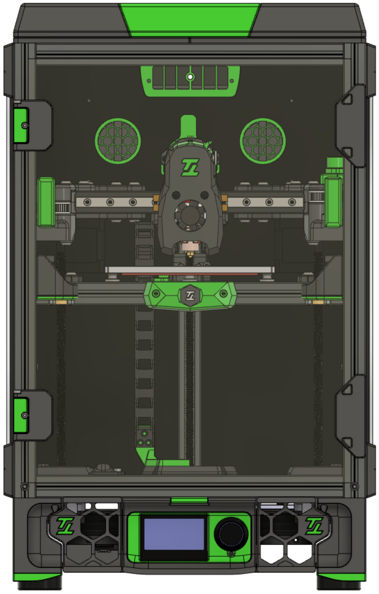

# Tiny-T (revision 2.0)

[](https://discord.gg/doomcube)


Tiny-T is a Voron Trident with build volume 150mm^3.

<p align="center">
  
</p>


Source: https://github.com/VoronDesign/Voron-Trident

License: [License](./LICENSE.txt)

Changes: Tiny-T "branding" and scale modelling down.


### Changes from revision 1.0 to revision 2.0

- With the addition of the tophat, the vertical extrusions are now back to 400mm, according to Trident specifications
- Side, Front and Rear panels have reduced their height by also 25mm
- Single front door
- New door hinges and handles
- New rear panel with mounting holes for the air filter
- New bed design that support M3 screws to hold the build plate aligned

Important: if ordering panels from vendors, make sure they are using the latest DXF files


## Frame Specs

If ordering from Misumi, these are the specs:

```
Misumi HFSB5-2020-400-LCP-RCP-AV260		4 (corner extrusion)
Misumi HFSB5-2020-270-TPW 			9 (top, bottom, front[top/bottom], rear top extrusions)
Misumi HFSB5-2020-270-AH135-TPW 		1 (rear bottom extrusion)
Misumi HFSB5-2020-230-LTP			1 (rear Z extrusion)
Misumi HFSB5-2020-230				1 (x gantry extrusion)
Misumi HFSB5-2020-140				1 (rear gantry extrusion)
Misumi HFSB5-2020-270-AH135			1 (bed extrusion)
Misumi HFSB5-2020-132-LTP			1 (bed extrusion)
```


## Components

- 2x 1200mm (120cm) GATE belts
- 6x Linear Rail MGN9H 200mm - [Ali Express](https://www.aliexpress.com/item/32773296501.html?spm=a2g0s.9042311.0.0.6ea64c4dDtOd7b)
- 150mmx150mm bed - [Mandala Roseworks](https://www.mandalaroseworks.com/shop/tiny-t)
- 150mm PEI Flex build plate - [Ali Express](https://www.aliexpress.com/item/1005003157344482.html?spm=a2g0s.9042311.0.0.6ea64c4dDtOd7b)
- 120mmx120mm 120w 24v heating pad - [Keenovo](https://keenovo.store/collections/standard-keenovo-silicone-heaters/products/keenovo-square-silicone-heater-3d-printer-build-plate-heatbed-heating-pad?variant=38120586870970)
- LDO Orbiter Extruder kit - [Fabreeko](https://www.fabreeko.com/products/ldo-orbiter-extruder-1-75mm?_pos=1&_sid=68aa9064c&_ss=r) OR LDO Galileo Clockwork kit - [Fabreeko](https://www.fabreeko.com/products/ldo-galileo-clockwork-kit?_pos=1&_sid=3b0226477&_ss=r)
- 2x LDO NEMA 17 stepper motors - [Printed Solid](https://www.printedsolid.com/products/ldo-nema-17-motor-high-temp-180c-ldo-42sth40-2004mah)
- 3x V0.1 Z Stepper motor with 150mm lead screw - [Fabreeko](https://www.fabreeko.com/products/ldo-42sth25-1004cl200evrn-v0-1-z-motor?_pos=9&_sid=546ac732a&_ss=r)
- 3x GE5C bearings - [Deep Fried Hero](https://deepfriedhero.in/products/ge5c-spherical-bushing-plain-bearing?_pos=2&_psq=ge&_ss=e&_v=1.0), [Ali Express](https://www.aliexpress.com/item/1005001493222143.html?spm=a2g0s.9042311.0.0.6ea64c4dDtOd7b)
- FYSETC V2.1 RGB Mini 12864 - [Amazon](https://www.amazon.com/gp/product/B08R9ZH7S2/ref=ppx_yo_dt_b_search_asin_title?ie=UTF8&psc=1)
- Amplifier Cabinet - [Amazon](https://www.amazon.com/gp/product/B00JJ191Z6/ref=ppx_yo_dt_b_search_asin_title?ie=UTF8&psc=1), [Ali Express](https://www.aliexpress.com/item/1005001469045379.html?srcSns=sns_Copy&spreadType=socialShare&bizType=ProductDetail&social_params=20279310410&aff_fcid=7957777e535a4b3c9616ff98efcb0673-1634268662620-05601-_mseXbAP&tt=MG&aff_fsk=_mseXbAP&aff_platform=default&sk=_mseXbAP&aff_trace_key=7957777e535a4b3c9616ff98efcb0673-1634268662620-05601-_mseXbAP&shareId=20279310410&businessType=ProductDetail&platform=AE&terminal_id=d351e39f504144729ff9c69423c32558)


### Mods used


- [Boop](https://github.com/VoronDesign/VoronUsers/tree/master/printer_mods/Ellis/Single_MGN9H_Carriage) by `Yeri`
- [RSCS](https://github.com/VoronDesign/VoronUsers/tree/master/printer_mods/Phalanx/Other-V2-Idlers) by `Derpimus` and `DoubleT`
- [Panel Support Clips](https://github.com/VoronDesign/VoronUsers/tree/master/printer_mods/wile-e1/Deck_Panel_Support_Clips) by `wile-e`
- [Tophat](https://github.com/jakub874/Jakub3DPrinterMods/tree/main/Tophat) by `jakub874`
